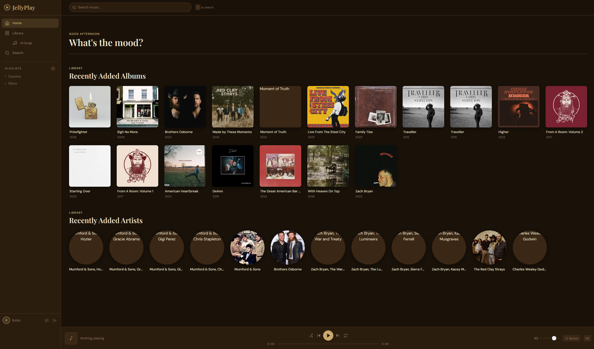
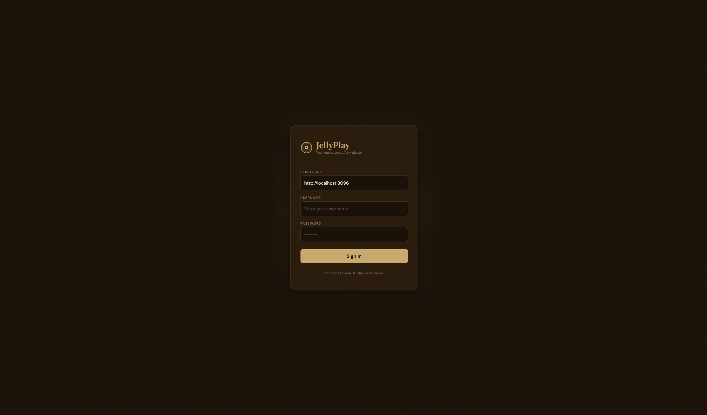

# JellyPlay

A beautiful music player for your [Jellyfin](https://jellyfin.org/) library. Plays your music the way it deserves — clean interface, warm design, no ads, no subscriptions.




---

## What is this?

JellyPlay is a web app that connects to your Jellyfin media server and gives you a Spotify-like experience for your own music collection. You host it yourself, your music stays yours.

## What you need

- A running [Jellyfin](https://jellyfin.org/) server with a music library
- Somewhere to host JellyPlay (your home server, NAS, VPS, etc.)
- (Optional) [Lidarr](https://lidarr.audio/) if you want to search and download new music directly from the app

## Installation

```bash
git clone https://github.com/MeatballsDev/jellyplay.git
cd jellyplay
docker compose up -d
```

JellyPlay will be available at `http://yourserver:4949`.

To update:

```bash
git pull
docker compose up -d --build
```

---

## Getting started

1. Open JellyPlay in your browser
2. Enter your Jellyfin server address, username, and password
3. Start listening

Your login is saved in your browser — you won't need to sign in again.

---

## Features

- **Browse your library** — albums, artists, and songs with search and sorting
- **Queue** — see what's playing next, drag to reorder, skip around
- **Playlists** — create and manage playlists, synced to your Jellyfin server
- **Equalizer** — 10-band EQ with presets (Bass Boost, Rock, Jazz, and more)
- **Shuffle & repeat** — shuffle your queue or loop tracks
- **Lidarr integration** — search for artists and albums you don't have yet and send them straight to Lidarr to download
- **Keyboard shortcuts** — control playback without touching the mouse

## Keyboard shortcuts

| Key | Action |
|---|---|
| `Space` | Play / pause |
| `←` | Previous track |
| `→` | Next track |
| `↑` / `↓` | Volume up / down |
| `M` | Mute |
| `S` | Shuffle |
| `E` | Equalizer |
| `/` | Search |
